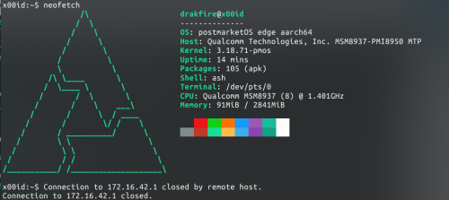

# Kernel fork for asus Zenfone 4 Max Plus (ZC554KL)
This kernel works only on Asus Zenfone 4 Max Plus ZC554KL / x00id.  

This repo contains my effort to port a new device to postmarketos. This allow you to boot a real GNU/Linux on this old phone.

Kernel is from Asus Open Source Center with some modifications to build with gcc 6.  

Works :  
* Display (don't use 3D driver for now)
* Touchscreen
* USB (otg works)  
* Wi-Fi  
* battery status  

Don't work :  
* ~~Wi-Fi (I am working on it)~~  
* Modem (Call, SMS ...)  
* Everything else ...  



## How to install ?

&#9888; __Be aware it is on beta version and a lot of things don't work yet.__ &#9888;  

REMEMBER! DO WITH YOUR OWN RISK! I'M NOT RESPONSIBLE FOR WHAT HAPPENS TO YOUR DEVICE 

This is a step by step guide made for you to be able to install postmarketos on Zenfone 4 Max Pro:  
1. First thing you need to unlock your bootloader:
* reboot to Bootloader by pressing power + vol up    
* open a terminal and Type command below:  
```
echo > key.txt   
fastboot oem get_unlock_key key.txt  
fastboot reboot-bootloader   
```
2. Now we have to install pmbootstrap:
* open a terminal and Type command below (at user not root)     
(I choose pip3 to install pmbootstrap but you can install it with git also)  
https://wiki.postmarketos.org/wiki/Installing_pmbootstrap  
```
pip3 install --user pmbootstrap  

```
3. Add asus x00id to pmboostrap:
```
cd /tmp  
git clone https://github.com/keystone-sideral/asus-ZC554KL  
cd asus-ZC554KL  
mkdir -p -v /home/$USER/.local/var/pmbootstrap/cache_git/pmaports/device/testing  
cp -r -v postmarketos/* /home/$USER/.local/var/pmbootstrap/cache_git/pmaports/device/testing/  
```
4. Initialization:  
```
pmbootstrap init  
```
Choose asus-x00id 
```
Device [samsung-i9100]: asus-x00id

```
5. Ui:  
For now, I recommand to choose xfce4 ou mate

Your file ```.config/pmbootstrap.cfg``` should look like :
```
[pmbootstrap]
aports = /home/xxx/.local/var/pmbootstrap/cache_git/pmaports
ccache_size = 0
is_default_channel = False
device = asus-x00id
extra_packages = htop,neofetch,vim,inxi,lm-sensors
hostname = x00id
build_pkgs_on_install = True
jobs = 10
kernel = stable
keymap = fr
locale = fr_FR.UTF-8
mirror_alpine = http://dl-cdn.alpinelinux.org/alpine/
mirrors_postmarketos = http://mirror.postmarketos.org/postmarketos/
nonfree_firmware = True
nonfree_userland = False
ssh_keys = True
ssh_key_glob = ~/.ssh/id_*.pub
timezone = Europe/Paris
ui = mate
ui_extras = False
user = drakfire
work = /home/xxx/.local/var/pmbootstrap
boot_size = 256
extra_space = 0
sudo_timer = True
qemu_redir_stdio = False
```
6. Installation:
```
pmbootstrap install
```
(you can open pmbootstrap log in another terminal)  
reboot to Bootloader by pressing power + vol up again
```
fastboot erase system
fastboot erase cache
fastboot erase userdata
pmbootstrap flasher flash_rootfs --partition userdata  
pmbootstrap flasher flash_kernel
fastboot reboot
```

## How to contribute ?

You can modify kernel config 
```
pmboostrap kconfig edit linux-asus-x00id
```

## Links

https://wiki.postmarketos.org/wiki/User:Alexeymin/Kernel_development_in_chroot_using_abuild  
https://wiki.postmarketos.org/wiki/Porting_to_a_new_device  
https://forum.xda-developers.com/t/guide-how-to-unlock-bootloader-zc554kl-do-with-your-own-risk.3677270/


